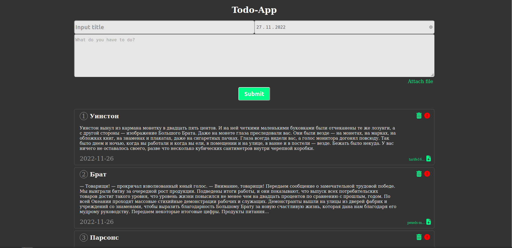
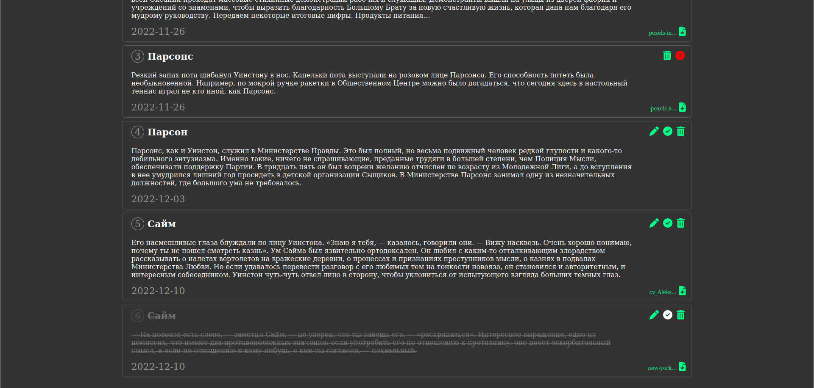

# Lite ToDo project on firebase

## For testing create file firebase if src directory.
Make new project in firebase and create firestore and storage.
Save yout firebase settings and export default "db".

## Functionality:

- add todo, consisted title, description, date to finish, attached file
- you can update title, description, choose new file to attach, mark as finished.

## Documentation

Open index.html in jsdoc

## How it looks

<table>
  <tr>
    <td>
      
    </td>
    <td>
      
    </td>
  </tr>
</table>
